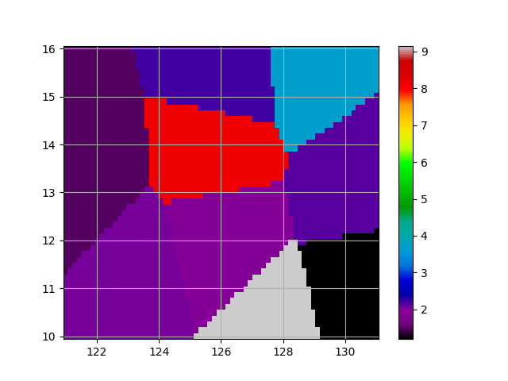

# Assessment: Interpolation
This directory contains my work toward the interpolation assessment.

## How to run
Install the necessary packages from the `requirements.txt` file
Run the `interpolate.py` script. Note: it does not save the figure as a file, it just displays it.

## Takeaways
I chose to use the nearest neighbor interpolation method because the ground truth data did not appear to be linear. I believed the linear interpolation method would be less accurate.

## Plot

